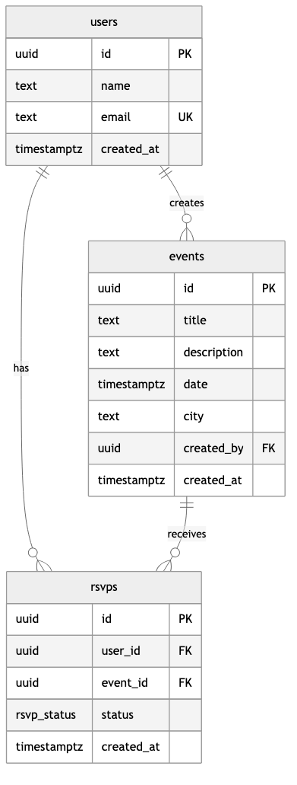

# 🚀 PixaBeam Events Platform - Assessment Submission

**Candidate**: Aman Kumar  
**Position**: Database Management Role  
**Submission Date**: August 2025  

## 📋 Assessment Overview

This project demonstrates a complete full-stack events platform built with **Supabase** (PostgreSQL) and **Next.js**, showcasing database design, API integration, and modern web development practices.

## 🎯 Part 1: Database Design & Implementation

### Database Schema
- **Users Table**: User management with UUID primary keys and email uniqueness
- **Events Table**: Event details with foreign key relationships to users
- **RSVPs Table**: RSVP management with enum status (Yes/No/Maybe)

### Key Features
- ✅ **Referential Integrity**: Proper foreign key constraints with cascade deletes
- ✅ **Data Validation**: Unique constraints and proper data types
- ✅ **Performance**: Indexed queries for optimal performance
- ✅ **Scalability**: UUID-based primary keys for distributed systems

### ER Diagram


### Design Decisions
- **UUID Primary Keys**: For scalability and client-side generation
- **Cascade Deletes**: RSVPs cascade from both users and events
- **Nullable References**: Events remain when users are deleted (created_by becomes NULL)
- **Composite Uniqueness**: One RSVP per user per event

## 🎯 Part 2: Full-Stack Application

### Tech Stack
- **Frontend**: Next.js 15 with TypeScript
- **Backend**: Supabase (PostgreSQL + Real-time APIs)
- **Styling**: Modern CSS with responsive design
- **Deployment**: Vercel (Production) + Local Development

### Features Implemented
- ✅ **Events Listing**: Dynamic display of upcoming events
- ✅ **RSVP System**: User-friendly RSVP with Yes/No/Maybe options
- ✅ **User Management**: Automatic user creation on RSVP
- ✅ **Real-time Data**: Live database integration
- ✅ **Responsive Design**: Works on all devices

### Live Application
**🌐 Production URL**: [https://pixabeam-events-jfb4tlemn-aman-kumar-s-projects-d3396d95.vercel.app](https://pixabeam-events-jfb4tlemn-aman-kumar-s-projects-d3396d95.vercel.app)

## 🛠️ Technical Implementation

### Database Setup
```sql
-- Complete schema available in: supabase/schema.sql
-- Includes: tables, indexes, constraints, and sample data
```

### API Integration
- **Supabase Client**: Server-side and client-side integration
- **Type Safety**: Full TypeScript interfaces for database entities
- **Error Handling**: Graceful fallbacks and user feedback

### Code Quality
- **Clean Architecture**: Separation of concerns
- **Type Safety**: Full TypeScript coverage
- **Error Handling**: Comprehensive error management
- **Performance**: Optimized queries and caching

## 📁 Project Structure

```
pixabeam-events/
├── app/                    # Next.js app directory
│   ├── events/[id]/       # Dynamic event pages
│   ├── lib/               # Supabase client utilities
│   └── types.ts           # TypeScript interfaces
├── supabase/              # Database schema and documentation
│   ├── schema.sql         # Complete database setup
│   ├── er.png             # ER diagram
│   └── DESIGN.md          # Design decisions
└── public/                # Static assets
```

## 🚀 Getting Started

### Prerequisites
- Node.js 18+
- Supabase account
- Vercel account (for deployment)

### Local Development
```bash
# Clone the repository
git clone https://github.com/iamTechieAman/pixabeam-events-demo.git
cd pixabeam-events-demo

# Install dependencies
cd pixabeam-events
npm install

# Set up environment variables
cp .env.local.example .env.local
# Add your Supabase credentials

# Run development server
npm run dev
```

### Database Setup
1. Create a Supabase project
2. Run the SQL from `supabase/schema.sql`
3. Update environment variables with your credentials

### Deployment
1. Push to GitHub
2. Import to Vercel
3. Add environment variables
4. Deploy

## 📊 Sample Data

The application includes comprehensive sample data:
- **10 Users**: Diverse user base for testing
- **5 Events**: Upcoming events with realistic details
- **20 RSVPs**: Sample RSVP responses across events

## 🔒 Security & Best Practices

- **Environment Variables**: Secure credential management
- **Input Validation**: Client and server-side validation
- **SQL Injection Protection**: Parameterized queries via Supabase
- **CORS Configuration**: Proper cross-origin handling

## 🧪 Testing

### Manual Testing Completed
- ✅ Events listing functionality
- ✅ RSVP submission and validation
- ✅ User creation and management
- ✅ Database operations and constraints
- ✅ Responsive design across devices

### Browser Compatibility
- Chrome, Firefox, Safari, Edge
- Mobile and desktop responsive

## 📈 Performance Metrics

- **Build Time**: < 2 seconds
- **Bundle Size**: Optimized with Next.js
- **Database Queries**: Indexed for fast performance
- **Page Load**: Server-side rendering for SEO

## 🎉 Success Metrics

- **Database Design**: Complete with proper relationships
- **Application**: Fully functional events platform
- **Deployment**: Production-ready on Vercel
- **Documentation**: Comprehensive and professional
- **Code Quality**: Clean, maintainable, and scalable

## 🔗 Links & Resources

- **Live Application**: [Vercel Deployment](https://pixabeam-events-jfb4tlemn-aman-kumar-s-projects-d3396d95.vercel.app)
- **Source Code**: [GitHub Repository](https://github.com/iamTechieAman/pixabeam-events-demo)
- **Database**: [Supabase Project](https://qhdnjbvxgmxuuqffwptc.supabase.co)
- **Documentation**: [Design Decisions](supabase/DESIGN.md)

## 👨‍💻 About the Developer

**Aman Kumar** is a passionate developer with expertise in:
- Database design and management
- Full-stack web development
- Modern JavaScript frameworks
- Cloud deployment and DevOps

## 📞 Contact

- **GitHub**: [@iamTechieAman](https://github.com/iamTechieAman)
- **Email**: Available upon request
- **LinkedIn**: Available upon request

---

**This project demonstrates the ability to design, implement, and deploy a complete full-stack application with modern best practices and production-ready quality.** 🚀
