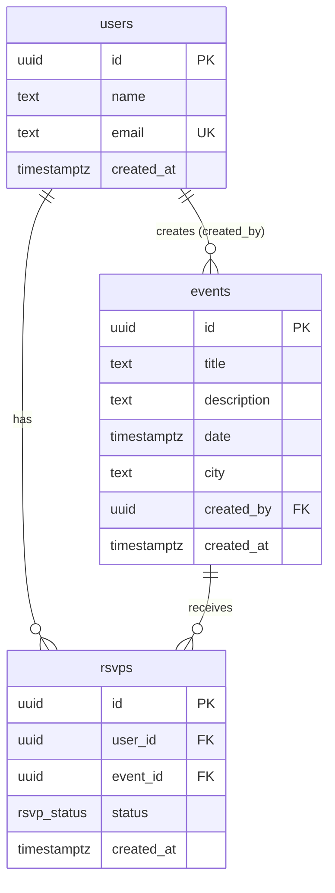

# ER Diagram (Mermaid)

```mermaid
erDiagram
  users {
    uuid id PK
    text name
    text email UK
    timestamptz created_at
  }

  events {
    uuid id PK
    text title
    text description
    timestamptz date
    text city
    uuid created_by FK
    timestamptz created_at
  }

  rsvps {
    uuid id PK
    uuid user_id FK
    uuid event_id FK
    rsvp_status status
    timestamptz created_at
  }

  users ||--o{ events : "creates (created_by)"
  users ||--o{ rsvps : "has"
  events ||--o{ rsvps : "receives"
```
